# Affinidi - Global Identifier for Travelers

## Problem Introduction

In the context of travelling, there is always a need for identifying travellers. For example, when a traveller books a hotel for the night, the hotel's receptionist will have to handle the identification process during their check-in. 

The traditional method involves heavily on physical exchange of identification documents such as passport and booking documents. The process is commonly known as Know-Your-Customer (KYC). This consumes a large chuck of time for both the receptionist and the traveller during check-in. On top of that, with the advent of COVID-19, it increases the risk of transmission during check-in

What if there is a way to use Affinidi API to shorten the process and make it safe?

## Scenario and Solution

Start-Up A (e.g called Global Identifier) decides to provide an universal service that aims to shorten and digitalize the identification process. This will be achieve by reducing down the check-in procedure to a single step. 

To achieve that, Start-Up A has to collect the traveller's information (e.g. Passport, Hotel Booking details) prior to the check-in. After checking and approving it, Start-Up A will provide an unique identifier to the traveller to save in their wallet.

On the day of the check-in, the traveller would simply have to share the identifier in their wallet to the hotel's receptionist through digital means and the check-in is done.

Simple!

## Affinidi use case

This is where Affinidi comes in. Start-Up A will leverage Affinidi's API to create the entire system. The whole scenario is broken down into 3 core players:

1. Holder - Traveller
2. Issuer - Start-Up A (Global Identifier Service Provider)
3. Verifier - Hotel

### Holder
The holder is a traveller that books the hotel during their travel. He or She are required to submit their passport photo, passport credentials and booking details to Start-Up A.

### Issuer
Start-Up A is the issuer that checks the information from the travellers. Start-Up A will conduct their own due diligence to ensure that the information are proper before giving the approval and sending the identifier to the the travellers.

### Verifier
During check-in, the hotel will receive the identifier from the traveller through digital means. This could include scanning QR code to access the Hotel's webpage. This process will remove the physical aspect of check-in. Upon receiving, they will verify the identifier with Start-Up A to ensure the following:

1. Traveller is who they say they are
2. They had made a reservation in the hotel
3. Their passport matches

## Value Proposition

Start-Up A creates value to both the travellers and the hotel. 

1. Reduce the check-in time for both hotel's receptionist and travellers
2. Remove the physical aspect of identification, especially important during COVID-19 situation
3. Reuse passport credentials for future check-ins using the same digital method

Affinidi helps Start-Up A by providing a fully built Self-Sovereign Identity infrastructure to plug-and-play. 

This reduces the cost of development and time required to build the entire system, which is a huge benefit for entrepreneur venturing companies like Start-Up A.

## How does it work? - Process

### Basic Requirements

Travellers will have to sign up with Affinidi to obtain the Affinidi's API key, API key Hash, username and password.

As for hotel bookings, travellers would also have to book a hotel before hand as per normal.

### Step 1

Travellers have to access the Start-Up A website to register their personal details, passport details and their booking details. Once the traveller entered the landing page, they have to click on the 'Start applying'.

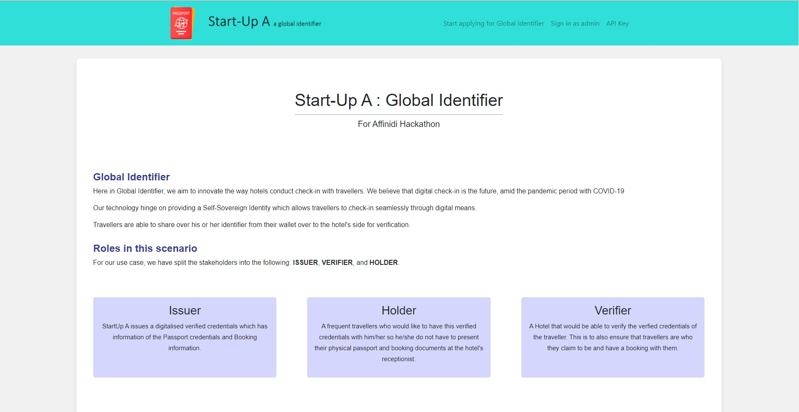

### Step 2

Next, traveller must log in with their Affinidi's username and password.

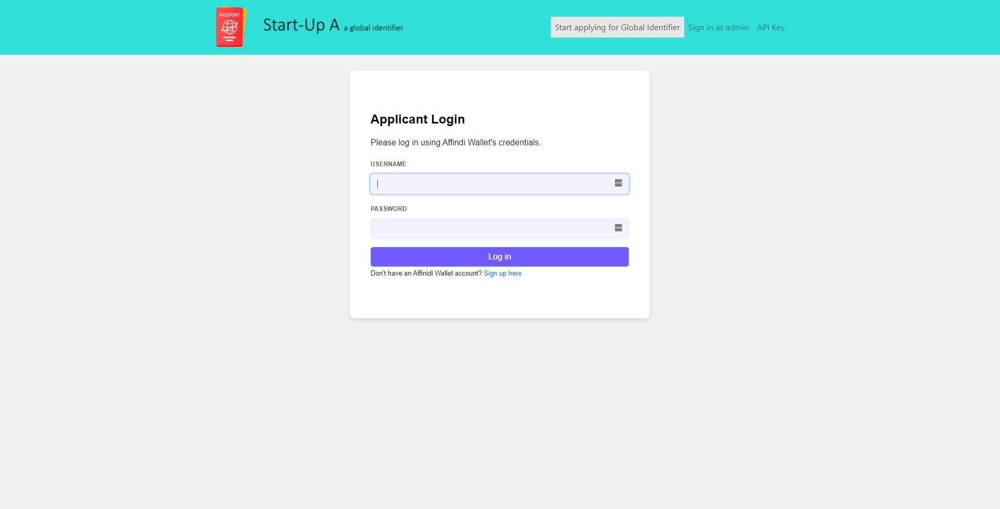

### Step 3

Once logged in, the traveller will be prompt to record down the following details:

1. Email Address
2. Given Name
3. Family Name
4. Passport Number
5. Passport Expiry Date
6. Hotel Booking ID
7. Hotel
8. Booking Service

and upload their Passport for due-diligence in background check.

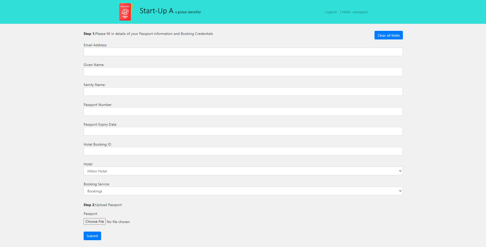

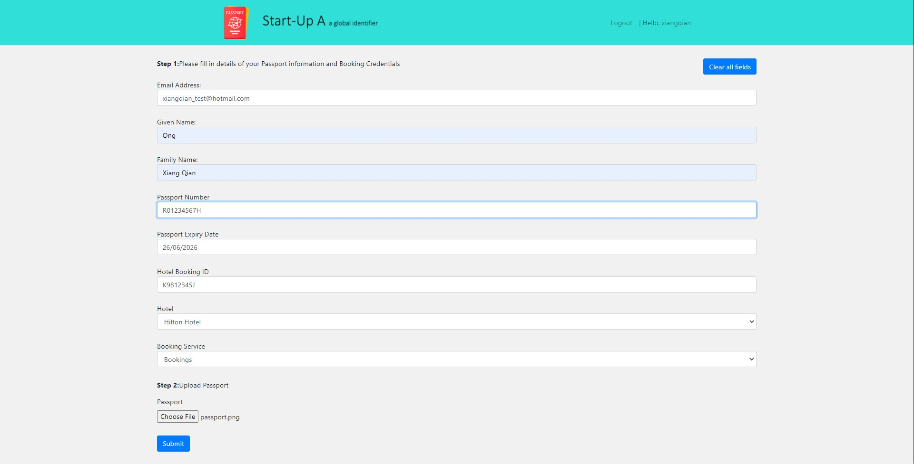

Traveller will press submit once they are done.

### Step 4

Following which, Start-Up A will login into the same page but through the Admin tab located in the nagivation bar. 

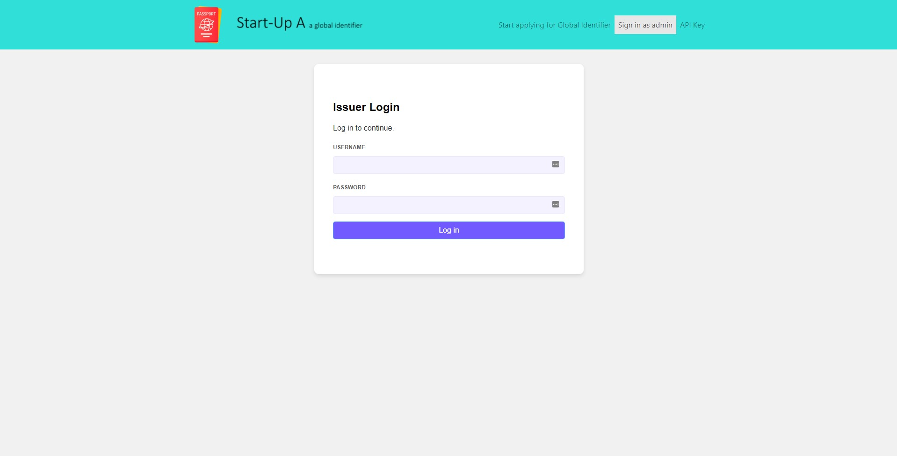

### Step 5 

They will select the latest application that was submited by the traveller on the dashboard.

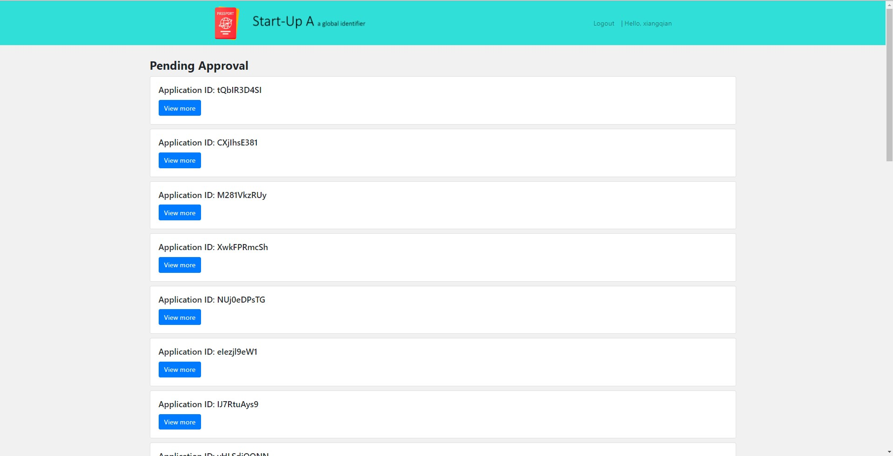

### Step 6

Once conducted due diligence on the traveller with Know-Your-Customer (KYC) tools, Start-Up A can choose to approve the application.

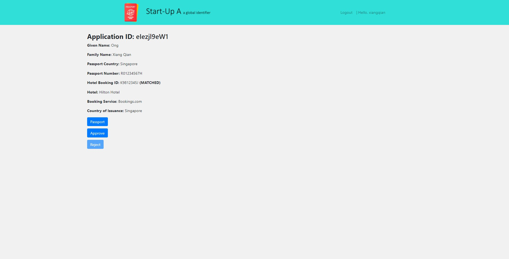

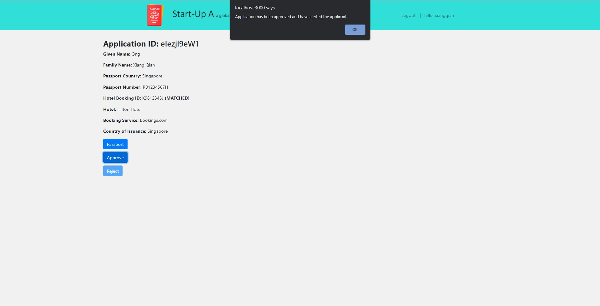

### Step 7

For the traveller, they will receive an email from Start-Up A to notify that their application has been approved. From the email, they will be provided a link to save the verifiable credential.


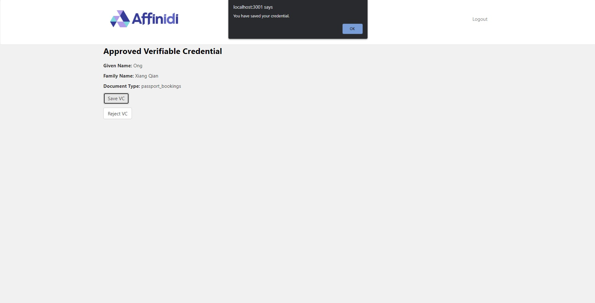

### Step 8 

--- **Fast forward to the day the traveller reached the hotel (e.g. Hilton Hotel)** ----

Once the the traveller reached the hotel, they can access the hotel's webpage either through QR code or just the URL.

From the webpage, they can choose to share their wallet.

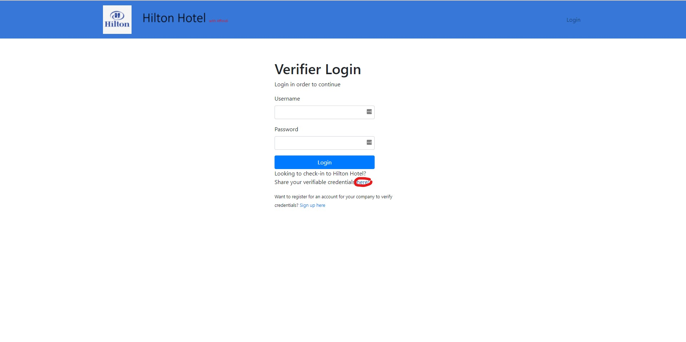

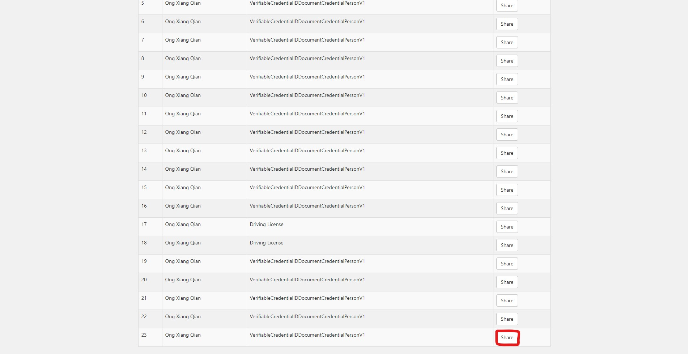

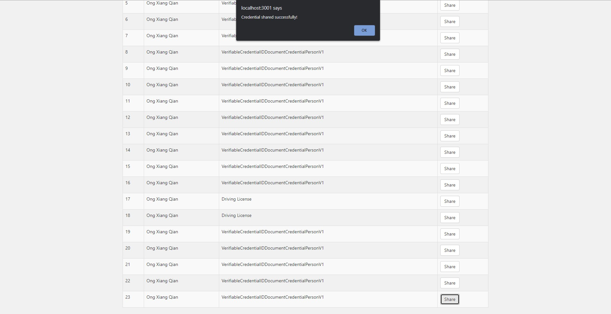

### Step 9

On the same webpage, the hotel (e.g. Hilton Hotel) can login using their own Affinidi credentials and access the dashboard. On the dashboard, they will be able to see and be assured that the traveller's identity is legit. All of this through digital means
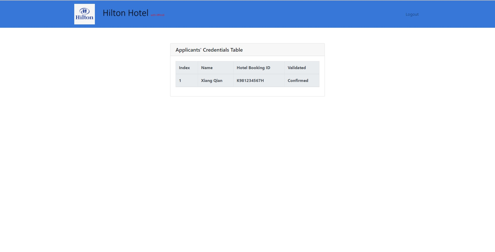


## End of Journey

With that, the traveller has successfully check-in into the hotel, all in a short time span and a contact-less method.

## How to run locally?

First, you would have to create firebase account as well as have a AWS SES access keys.

For each of the folders - issuer, holder and verifier you would have to do the following:

```shell
# Copy the .env.example into a new file called .env
cp .env.example .env

# Populate the .env with credentials

npm install

npm start
```

Run issuer, holder and verifier in the same order

## Credits

The code base was built on top of the Affinidi use case implementation to express the idea. The following are the URLS of the repositories.

https://github.com/affinityproject/affinidi-drivinglicense-verifier

https://github.com/affinityproject/affinidi-drivinglicense-issuer

https://github.com/affinityproject/affinidi-drivinglicense-holder